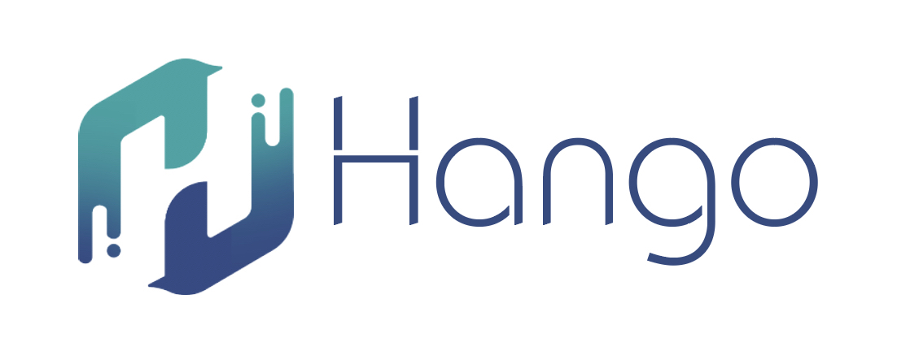
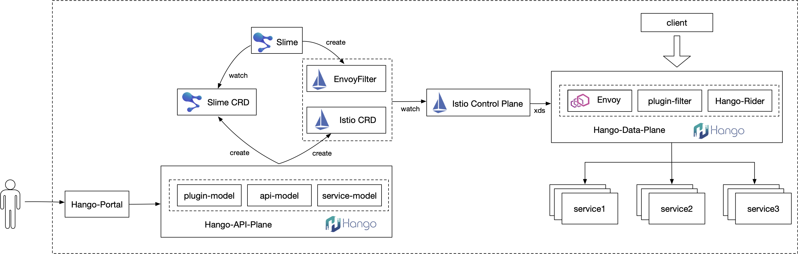
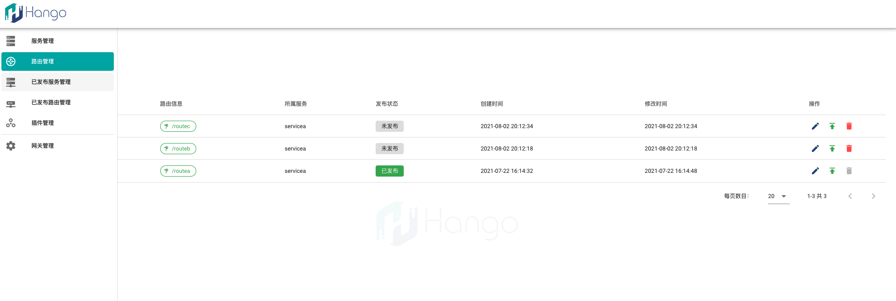

[//]: # "README"

# Hango

[English version](README.EN.md)

Hango 是一个基于 **Envoy** 构建的高性能、可扩展、功能丰富的云原生API网关。

Hango 提供请求代理、动态路由、负载均衡、限流、熔断、健康检查、安全防护等功能，可用于微服务网关、七层负载均衡、Kubernetes Ingress、Serverless网关等应用场景。

通过[Hango Rider](https://github.com/hango-io/rider)模块，用户可以自定义多语言插件进行能力扩展。

##  为什么选择Hango

* **技术路线**：基于领先的网络代理组件 **Envoy** 构建，具备丰富的功能、优异的性能与可观测性

* **扩展性**：可用于生产的增强级 Lua 扩展框架 Rider；基于 WebAssembly 的多语言扩展插件能力（Alpha，后续提供）

* **多场景**：具备支撑微服务网关、七层负载均衡、Kubernetes Ingress、Serverless网关等多种场景能力

* **云原生**：以云原生标准数据面组件 **Envoy** 作为核心引擎，天然亲和云原生；可作为 Kubernetes、**Service Mesh**、Serverless 的 Ingress、Gateway 实现

* **API生态与集成**：以 API 为中心的生态管理，提供数百种工业级协议快速集成能力（后续提供）

* **控制平面**：易用的控制台进行网关、服务、路由等多维度管理，简化使用者操作

## 提要

[特性](#features)

[架构](#archi)

[工程](#pro)

[安装](#install)

[使用](#usage)

[交流](#community)

[License](#license)

## 特性

* HTTP、gRPC、Websocket 等多协议代理

* 支持 Kubernetes 等注册中心服务发现

* L7 流量代理、连接池配置

* 基于请求参数的动态路由、主动被动健康检查策略、丰富的负载均衡算法

* 多场景限流、熔断、降级、重试等流量治理功能

* IP黑白名单控制、认证鉴权等安全防护功能

* 自定义Header黑白名单，内置UA、Refer黑白名单

* 可视化控制台进行网关配置管理

* 得益于 Envoy 优异的性能，单实例性能可达10w TPS以上

* 自定义插件框架，支持用户用多种语言开发自定义插件，参考[Hango自定义插件使用手册](./example/rider_user_guide.zh_CN.md)

## 架构

Hango 基于云原生理念构建，数据面基于 Envoy 进行扩展，增强插件链，提供 Rider 模块用于自定义插件扩展；控制面组件包括 Slime，Istio，API Plane 以及 Portal 模块。

得益于 [Slime](https://github.com/slime-io/slime) 良好的扩展性与兼容性，用户可以直接选择社区 [Istio](https://github.com/istio/istio) 作为控制面进行 Hango 构建。

##  工程

Hango 是一个云原生架构下的网关项目，聚合了以下工程：

* [Envoy Proxy](https://github.com/hango-io/envoy-proxy) - 数据面组件，南北流量入口
* [Slime](https://github.com/slime-io/slime) - 将Slime CRD转换为Istio CRD
* [Istio](https://github.com/istio/istio) - 核心控制面，生成对应的xDS配置，下发至Envoy
* [API Plane](https://github.com/hango-io/api-plane) - 用于生成Istio CRD以及Slime CRD
* [Gateway Portal](https://github.com/hango-io/portal) - Hango 控制台Portal
* [Gateway UI](https://github.com/hango-io/ui) - Hango 控制台UI

可以点击链接详细了解每个项目模块。

## 安装

目前，安装Hango需要具备Kubernetes环境，目前支持1.17及以上 Kubernetes。
通过Helm，可以一键部署Hango。具体部署可以参考[Hango部署手册](./install/README.zh_CN.md)

## 使用

Hango UI提供了用户使用指南，通过使用指南用户可以方面上手 Hango，可以参考[通过Hango UI配置Hango路由](./example/expose_api_with_ui.zh_CN.md)

同时，也可以通过API调用的方式进行配置，可以参考[通过OpenAPI配置Hango路由](./example/expose_api.zh_CN.md)

## 交流

真诚的欢迎各位和我们进行交流. 我们提供以下方式：

* 邮件：hango.io@gmail.com
* qq群：Hango 交流群 914823850
* 参考[CONTRIBUTING.md](CONTRIBUTING.md) 和 [CODE_OF_CONDUCT.md](CODE_OF_CONDUCT.md) 文件

同时，也可以通过以下方式进行项目贡献：

* 博客
* Issue
* 测试
* 文档完善等

## 致谢
Hango 的建设离不开社区成员有价值的工作，这里特别感谢 [Envoy](https://www.envoyproxy.io/) 与 [Istio](https://github.com/istio/istio) 

## License

[Apache-2.0](https://choosealicense.com/licenses/apache-2.0/)
