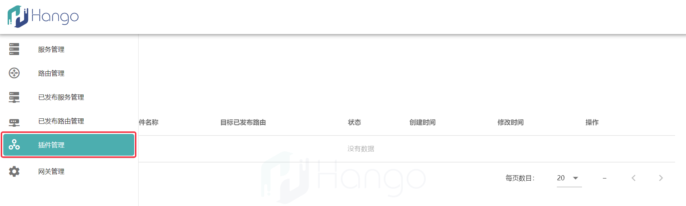
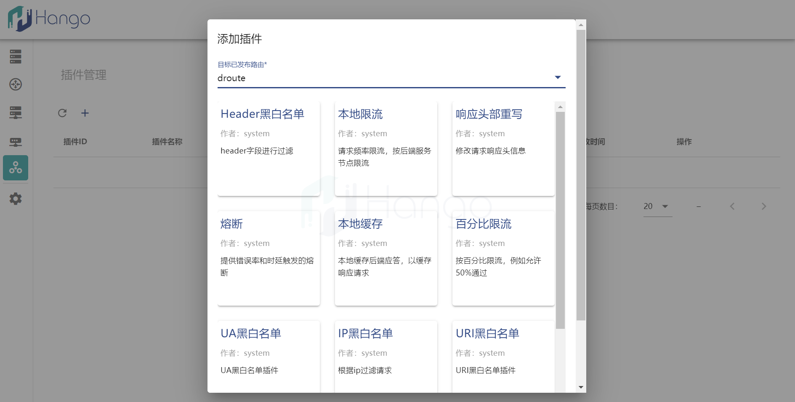

# 插件配置方法

1.通过Hango主页左侧Tab栏中的`插件管理`进入插件配置主页

2.点击`+`符号添加插件，选择指定的路由为其配置某款插件

3.选择路由后界面将展示可配置的插件列表

4.选择需要配置的插件后将展示该插件的具体配置页面（案例为百分比限流插件），正确配置后点击`确认`按钮即可完成插件配置

5.完成插件配置后，插件界面将展示插件信息及其相关操作，后续可以通过`操作栏`对该插件进行`更新`或`删除`

