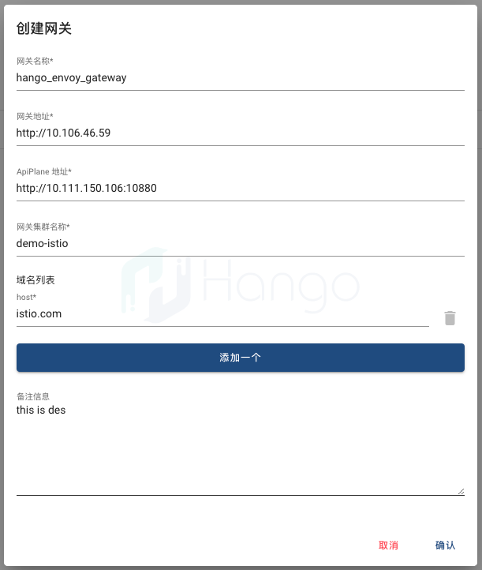

# 界面化管理Hango 网关路由

通过`Hango UI`创建服务和路由，同时进行服务和路由发布，便捷使用Hango网关。

## 获取Hango UI 访问地址
通过[Hango部署手册](../install/README.zh_CN.md)完成部署，可以查看hango相关Kubernetes service信息：

```shell
> kubectl get svc -n hango-system
NAME              TYPE        CLUSTER-IP       EXTERNAL-IP   PORT(S)                                           AGE
gateway-proxy     NodePort    10.106.46.59     <none>        15021:32318/TCP,80:30591/TCP,443:32522/TCP        23h
hango-api-plane   ClusterIP   10.111.150.106   <none>        10880/TCP                                         23h
hango-portal      NodePort    10.107.179.97    <none>        80:30621/TCP                                      23h
hango-ui          NodePort    10.100.82.153    <none>        8789:30829/TCP                                    23h
istio-e2e-app     ClusterIP   10.100.15.26     <none>        80/TCP,8080/TCP,90/TCP,9090/TCP,70/TCP,7070/TCP   23h
istiod            ClusterIP   10.109.241.243   <none>        15010/TCP,15012/TCP,443/TCP,15014/TCP             23h
plugin            ClusterIP   10.96.91.4       <none>        80/TCP                                            23h
slime-metrics     ClusterIP   10.102.87.122    <none>        8383/TCP,8686/TCP                                 23h
```
通过主页README说明如下：
- `gateway-proxy`

其中`hango-ui`是我们的目标服务，它是NodePort类型，可以通过主机IP地址+端口访问，可以在浏览器中输入如下地址，即可访问`Hang UI`：
```shell
http://{{所在k8s集群的任一主机IP}}:{{NodePort端口，这里是30829}}
```

## 创建网关

由于发布服务和路由必须先要有网关，创建网关是第一步。官方提供了一个[网关初始化脚本](../install/init-hango/init.sh)，可以直接使用。通过`网关管理`页面创建网关，示例如下所示：

   

其中：
- 网关名称，即`GwName`，可自行填写，如`“hango_envoy_gateway”`；
- 网关地址，即`GwAddr`，指`gateway proxy`组件的访问地址，可以填写上文的`gateway-proxy`的k8s服务地址，端口不用填默认80；
- ApiPlane地址，即`ApiPlaneAddr`，指`api plane`组件的访问地址，可以填写上文的`hango-api-plane`的k8s服务地址和端口；
- 网关集群名称，即`GwClusterName`，如`“demo-istio”`；
- 域名列表，即`HostList`，如`“istio.com”`；
- 备注信息，即`Description`，可自行填写；

## 创建服务

通过`服务管理`页面创建服务，例如，创建一个名为hango-test的服务。

1. 点击 `+`，创建一个新的服务：

   

2. 输入`"服务名称"`、`"服务标识"`等信息，点击创建：

   

## 创建路由

通过`路由管理`页面创建路由，路由从属于服务；例如创建一个前缀为/hango/unit的路由，hango-route-test。

1. 点击 `+`，创建一个新的路由，选择`"所属服务"`、填写`“路由名称”`，默认使用`Path`作为路由条件，输入单个或多个`"条件取值"`，点击创建：

   

2. 除了默认的`Path`路由分发方式，还提供基于`Host`、`Method`、`Header`、`Query`多种方式，应对不同场景，灵活性高。

   


## 发布服务

新建服务需要通过发布后，才能被访问，例如，发布刚创建的hango-test服务。

1. 通过`服务管理`页面的`发布`按钮，进行服务发布操作：
  
   

2. 选择已有的`"目标网关"`，选择`"从注册中心同步"`作为发布方式，选择`"K8S注册中心"`作为注册中心，选择`"istio-e2e-app.hango-system.svc.cluster.local"`作为服务地址，点击确认：

   

3. 服务发布成功后，可以在`"已发布服务管理"`页面查看：

   

## 发布路由

通过声明服务端口进行路由发布，一旦路由发布成功，就可以通过hango网关调用路由。例如，发布路由至服务80端口。

1. 与服务发布类似，通过`路由管理`页面的`发布`按钮，进行路由发布操作。选择已有的`"目标网关"`后，即可自动填充相关字段，可调整端口和超时时间：

    

## 验证路由

可以通过调用`gateway proxy`组件，配合路由条件，验证路由是否成功。`gateway proxy`已提供NodePort服务，验证方式如下：

```shell
curl "http://{{所在k8s集群的任一主机IP}}:{{NodePort端口，这里是30591}}/hango/unit" -H "host:istio.com"
```

返回结果：

```shell
ServiceVersion=v1
ServicePort=80
Host=istio.com
Method=GET
URL=/hango/unit
Proto=HTTP/1.1
RemoteAddr=10.0.0.192:59042
Method=GET
X-B3-Traceid=6cde016d694758c06f082afb06e746a9
Accept=*/*
X-Request-Id=0c254c7f-cade-46e5-ac98-0d8964198bab
X-Envoy-Decorator-Operation=istio-e2e-app.hango-system.svc.cluster.local:80/hango/unit.*
X-Envoy-Expected-Rq-Timeout-Ms=60000
X-B3-Sampled=0
User-Agent=curl/7.68.0
X-Forwarded-For=xx.xx.xx.xx
X-Envoy-External-Address=xx.xx.xx.xx
Content-Length=0
X-Forwarded-Proto=http
X-Envoy-Attempt-Count=1
X-B3-Spanid=6f082afb06e746a9
Hostname=istio-e2e-app-85bb49bf75-crlhm
```

