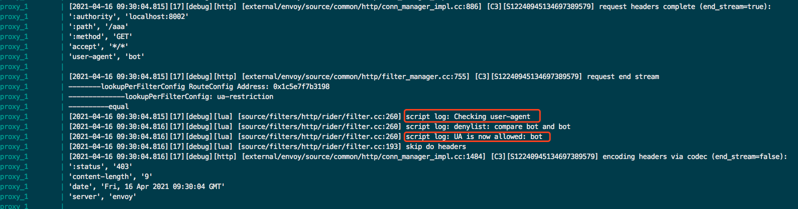

# Hango网关自定义插件使用教程

## 一、插件需求

实现一个UA黑白名单插件。支持控制台配置UA黑名单/白名单。

## 二、编写lua插件、调试

### 2.1 rider开发

rider是hango团队开源的自定义插件包，通过rider结合envoy热加载能力，动态扩展自定义插件。

（1）2.1.1 在rider根目录下，建立plugins/ua-restriction.lua 目录用于存放插件代码

创建plugins/ua-restriction.lua，添加如下代码

包括两部分：插件schema配置以及插件执行逻辑配置；schema配置又可以分为base_json_schema全局配置以及route_json_schema路由配置。全局配置用于配置插件的公共配置，例如外部认证服务等全局配置；路由配置为插件的核心配置，大多数场景只需要编写route_json_schema即可。

插件执行逻辑，依赖rider封装的sdk，进行对应的插件链路开发。我们的例子便是，通过在gateway的请求链路上，获取user-agent对应的header进行配置对比，如果不存在user-agent header，则返回400，“user-agent not found”，如果匹配ua黑名单则返回403 “Forbidden”

```lua
require("rider")
local envoy = envoy
local get_req_header = envoy.req.get_header
local ipairs = ipairs
local re_find = string.find
local respond = envoy.respond
local logDebug = envoy.logDebug

local uaRestrictionHandler = {}

local BAD_REQUEST = 400
local FORBIDDEN = 403

local MATCH_EMPTY     = 0
local MATCH_WHITELIST = 1
local MATCH_BLACKLIST = 2

local json_validator = require("rider.json_validator")

local base_json_schema = {
    type = 'object',
    properties = {},
}

local route_json_schema = {
    type = 'object',
    properties = {
      allowlist = {
        type = 'array',
        items = {
          type = 'string',
        },
      },
      denylist = {
        type = 'array',
        items = {
          type = 'string',
        },
      },
    },
}
json_validator.register_validator(base_json_schema, route_json_schema)

--- strips whitespace from a string.
local function strip(str)
  if str == nil then
    return ""
  end
  str = tostring(str)
  if #str > 200 then
    return str:gsub("^%s+", ""):reverse():gsub("^%s+", ""):reverse()
  else
    return str:match("^%s*(.-)%s*$")
  end
end

local function get_user_agent()
  return get_req_header("user-agent")
end

local function examine_agent(user_agent, allowlist, denylist)
  user_agent = strip(user_agent)

  if allowlist then
    for _, rule in ipairs(allowlist) do
      logDebug("allowist: compare "..rule.." and "..user_agent)
      if re_find(user_agent, rule) then
        return MATCH_WHITELIST
      end
    end
  end

  if denylist then
    for _, rule in ipairs(denylist) do
      logDebug("denylist: compare "..rule.." and "..user_agent)
      if re_find(user_agent, rule) then
        return MATCH_BLACKLIST
      end
    end
  end

  return MATCH_EMPTY
end

function uaRestrictionHandler:on_request()
  local config = envoy.get_route_config()
  if config == nil then
    return
  end

  logDebug("Checking user-agent");

  local user_agent = get_user_agent()
  if user_agent == nil then
    return respond({[":status"] = BAD_REQUEST}, "user-agent not found")
  end

  local match  = examine_agent(user_agent, config.allowlist, config.denylist)

  if match > 1 then
    logDebug("UA is now allowed: "..user_agent);
    return respond({[":status"] = FORBIDDEN}, "Forbidden")
  end
end

return uaRestrictionHandler

```

### 2.2 rider 调试

修改script/dev/envoy.yaml文件，增加对应的http_filter配置，具体如下：

```yaml
- name: proxy.filters.http.rider
    typed_config:
      "@type": type.googleapis.com/proxy.filters.http.rider.v3alpha1.FilterConfig
      plugin:
        vm_config:
          package_path: "/usr/local/lib/rider/?/init.lua;/usr/local/lib/rider/?.lua;"
        code:
          local:
            filename: /usr/local/lib/rider/plugins/ua-restriction.lua
        name: ua-restriction
        config: {}
```

增加对应route配置，具体配置如下：

```yaml
typed_per_filter_config:
  proxy.filters.http.rider:
    "@type": type.googleapis.com/proxy.filters.http.rider.v3alpha1.RouteFilterConfig
    plugins:
      # Plugin config here applies to the Route
      - name: ua-restriction
        config:
          denylist:
          - bot
```

执行`./scripts/dev/local-up.sh` 启动 hango-gateway和一个简单的 HTTP 服务。

通过`curl -v http://localhost:8000/anything -H 'User-Agent:bot'`



response: `403 Foebidden`

### 2.3 控制台schema开发

通过开发对应的插件schema，可以将插件暴露至网关控制台，便于用户进行配置。

通过编写json schema，将对应的ua-restriction插件暴露在hango控制台。前端schema开发可以参考schema开发手册.md。

根据需求，开发ua-restriction 前端schema如下：

```json
{
  "formatter": {
    "kind": "ua-restriction",
    "type": "lua",
    "config": {
      "allowlist": "&allowlist",
      "denylist": "&denylist"
    }
  },
  "layouts": [
    {
      "key": "allowlist",
      "alias": "白名单",
      "help": "User-Agent优先匹配白名单，命中之后直接放行，支持正则",
      "type": "multi_input",
      "rules": [
      ]
    },
    {
      "key": "denylist",
      "alias": "黑名单",
      "help": "User-Agent优先匹配白名单，没有命中，继续匹配黑名单，命中之后直接禁止，支持正则",
      "type": "multi_input",
      "rules": [
      ]
    }
  ]
}
```

## 三、集成插件至hango

### 3.1 集成插件至hango-envoy

（1）在rider目录下，执行

```yaml
kubectl create configmap hango-rider-plugin --from-file=plugins/ -n hango-system
```

（2）等待10s左右，即将对应的plugins加载至hango-gateway中

### 3.2 集成插件至api-palne

（1）明确插件的级别

hango网关自定义插件支持两种级别：全局级别和路由级别；全局级别即整个网关级别，生效顺序是优先路由级插件生效。

全局配置入口为：【插件管理】-> 【添加全局插件】。配置一个全局插件后，该网关的所有路由均生效

路由级别配置入口为：【已发布信息】-> 【已发布路由】-> 【插件】-> 【添加全局插件】。配置一个路由级插件后，仅对当前路由生效。

（2）修改api-plane工程 /plugin/route 目录下的plugin-config.json增加对应的插件声明

```json
{
    "name": "ua-restriction",
    "displayName": "UA黑白名单", 
    "schema": "plugin/route/ua-restriction.json",
    "description": "UA黑白名单插件",
    "processor": "AggregateGatewayPluginProcessor",
    "author": "system",
    "createTime": "1572537600000",
    "updateTime": "1572537600000",
    "pluginScope": "global,routeRule",  
    "instructionForUse": "UA黑白名单插件",
    "categoryKey": "security",  
    "categoryName": "安全"
 }
```

(3) 在/plugin/route目录下增加ua-detection.json schema文件

```json
---ua-restriction.json
{
  "formatter": {
    "kind": "ua-restriction",
    "type": "lua",
    "config": {
      "allowlist": "&allowlist",
      "denylist": "&denylist"
    }
  },
  "layouts": [
    {
      "key": "allowlist",
      "alias": "白名单",
      "help": "User-Agent优先匹配白名单，命中之后直接放行，支持正则",
      "type": "multi_input",
      "rules": [
      ]
    },
    {
      "key": "denylist",
      "alias": "黑名单",
      "help": "User-Agent优先匹配白名单，没有命中，继续匹配黑名单，命中之后直接禁止，支持正则",
      "type": "multi_input",
      "rules": [
      ]
    }
  ]
}
```

(4) 执行以下指令，生成对应的插件configmap

```shell
kubectl create configmap hango-plugin --from-file=plugin/route/ -n hango-system
```

(5) 等待大约10s，待configmap加载成功即可以使用自定义插件。
