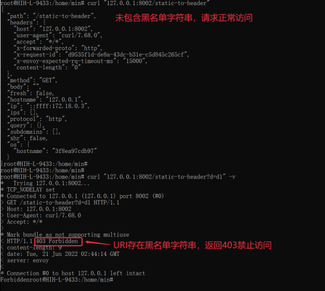

# Hango网关自定义插件使用教程

## 一、插件需求

实现一个URI黑白名单插件。支持控制台配置URI黑名单/白名单。

## 二、编写lua插件、调试

### 2.1 rider开发

rider是hango团队开源的自定义插件包，通过rider结合envoy热加载能力，动态扩展自定义插件。

（1）2.1.1 在rider根目录下，建立plugins/uri-restriction.lua 目录用于存放插件代码

创建plugins/uri-restriction.lua，添加如下代码

包括两部分：插件schema配置以及插件执行逻辑配置；schema配置又可以分为base_json_schema全局配置以及route_json_schema路由配置。全局配置用于配置插件的公共配置，例如外部认证服务等全局配置；路由配置为插件的核心配置，大多数场景只需要编写route_json_schema即可。

插件执行逻辑，依赖rider封装的sdk，进行对应的插件链路开发。我们的例子便是，对请求URI进行黑白名单控制；当请求URI中的字符符合白名单规则，优先放行；若请求URI中的字符未匹配白名单规则且匹配黑名单规则，则请求返回403错误码，并相应Forbidden字符串

```lua
--[[
引入v2 rider版本
v2版本相对v1版本将request和response分为header和body部分处理，提升不同场景的插件性能
-- ]] 
require('rider.v2')

-- 定义本地变量
local envoy = envoy
local request = envoy.req
local respond = envoy.respond

-- 定义本地常量
local NO_MATCH = 0
local MATCH_WHITELIST = 1
local MATCH_BLACKLIST = 2
local BAD_REQUEST = 400
local FORBIDDEN = 403

local uriRestrictionHandler = {}

uriRestrictionHandler.version = 'v2'

local json_validator = require('rider.json_validator')

-- 定义全局配置
local base_json_schema = {
    type = 'object',
    properties = {}
}

-- 定义路由级配置
local route_json_schema = {
    type = 'object',
    properties = {
        allowlist = {
            type = 'array',
            items = {
                type = 'string'
            }
        },
        denylist = {
            type = 'array',
            items = {
                type = 'string'
            }
        }
    }
}

json_validator.register_validator(base_json_schema, route_json_schema)

-- 定义本地校验uri黑白名单方法
local function checkUriPath(uriPath, allowlist, denylist)
    if allowlist then
        for _, rule in ipairs(allowlist) do
            envoy.logDebug('allowist: compare ' .. rule .. ' and ' .. uriPath)
            if string.find(uriPath, rule) then
                return MATCH_WHITELIST
            end
        end
    end

    if denylist then
        for _, rule in ipairs(denylist) do
            envoy.logDebug('denylist: compare ' .. rule .. ' and ' .. uriPath)
            if string.find(uriPath, rule) then
                return MATCH_BLACKLIST
            end
        end
    end

    return NO_MATCH
end

-- 定义request的header阶段处理函数
function uriRestrictionHandler:on_request_header()
    local uriPath = request.get_header(':path')
    local config = envoy.get_route_config()

    envoy.logInfo('start lua uriRestriction')
    if uriPath == nil then
        envoy.logErr('no uri path!')
        return
    end

    -- 配置未定义报错
    if config == nil then
        envoy.logErr('no route config!')
        return
    end

    local match = checkUriPath(uriPath, config.allowlist, config.denylist)

    envoy.logDebug('on_request_header, uri path: ' .. uriPath .. ', match result: ' .. match)

    if match > 1 then
        envoy.logDebug('path is now allowed: ' .. uriPath)
        return respond({[':status'] = FORBIDDEN}, 'Forbidden')
    end
end

return uriRestrictionHandler
```

### 2.2 rider 调试

修改script/dev/envoy.yaml文件，增加对应的http_filter配置，具体如下：

```yaml
- name: proxy.filters.http.rider
    typed_config:
      "@type": type.googleapis.com/proxy.filters.http.rider.v3alpha1.FilterConfig
      plugin:
        vm_config:
          package_path: "/usr/local/lib/rider/?/init.lua;/usr/local/lib/rider/?.lua;"
        code:
          local:
            filename: /usr/local/lib/rider/plugins/uri-restriction.lua
        name: uri-restriction.lua
        config: {}
```

增加对应route配置，具体配置如下：

```yaml
typed_per_filter_config:
  proxy.filters.http.rider:
    "@type": type.googleapis.com/proxy.filters.http.rider.v3alpha1.RouteFilterConfig
    plugins:
      - name: uri-restriction
        config:
          allowlist:
            - a1
          denylist:
            - d1
```

执行`./scripts/dev/local-up.sh` 启动 hango-gateway和一个简单的 HTTP 服务。

通过`curl -v http://localhost:8002/static-to-header`



response: `403 Foebidden`

### 2.3 控制台schema开发

通过开发对应的插件schema，可以将插件暴露至网关控制台，便于用户进行配置。

通过编写json schema，将对应的uri-restriction插件暴露在hango控制台。前端schema开发可以参考schema开发手册.md。

根据需求，开发uri-restriction 前端schema如下：

```json
{
  "formatter": {
    "kind": "uri-restriction",
    "type": "lua",
    "config": {
      "allowlist": "&allowlist",
      "denylist": "&denylist"
    }
  },
  "layouts": [
    {
      "key": "allowlist",
      "alias": "白名单",
      "help": "URI优先匹配白名单，命中之后直接放行，支持正则",
      "type": "multi_input",
      "rules": [
      ]
    },
    {
      "key": "denylist",
      "alias": "黑名单",
      "help": "URI优先匹配白名单，没有命中，继续匹配黑名单，命中之后直接禁止，支持正则",
      "type": "multi_input",
      "rules": [
      ]
    }
  ]
}
```

## 三、集成插件至hango

### 3.1 集成插件至hango-envoy

（1）在rider目录下，执行

```yaml
kubectl create configmap hango-rider-plugin --from-file=plugins/ -n hango-system
```

（2）等待10s左右，即将对应的plugins加载至hango-gateway中

### 3.2 集成插件至api-palne

（1）明确插件的级别

hango网关自定义插件支持两种级别：全局级别和路由级别；全局级别即整个网关级别，生效顺序是优先路由级插件生效。

全局配置入口为：【插件管理】-> 【添加全局插件】。配置一个全局插件后，该网关的所有路由均生效

路由级别配置入口为：【已发布信息】-> 【已发布路由】-> 【插件】-> 【添加全局插件】。配置一个路由级插件后，仅对当前路由生效。

（2）修改api-plane工程 /plugin/route 目录下的plugin-config.json增加对应的插件声明

```json
{
  "name": "uri-restriction",
  "displayName": "URI黑白名单",
  "schema": "plugin/route/uri-restriction.json",
  "description": "URI黑白名单插件",
  "processor": "AggregateGatewayPluginProcessor",
  "author": "system",
  "createTime": "1655279630000",
  "updateTime": "1655279630000",
  "pluginScope": "global,routeRule",
  "pluginPriority": "3000",
  "instructionForUse": "URI黑白名单插件",
  "categoryKey": "security",
  "categoryName": "安全"
}
```

(3) 在/plugin/route目录下增加uri-restriction.json schema文件

```json
---uri-restriction.json
{
  "formatter": {
    "kind": "uri-restriction",
    "type": "lua",
    "config": {
      "allowlist": "&allowlist",
      "denylist": "&denylist"
    }
  },
  "layouts": [
    {
      "key": "allowlist",
      "alias": "白名单",
      "help": "URI优先匹配白名单，命中之后直接放行，支持正则",
      "type": "multi_input",
      "rules": [
      ]
    },
    {
      "key": "denylist",
      "alias": "黑名单",
      "help": "URI优先匹配白名单，没有命中，继续匹配黑名单，命中之后直接禁止，支持正则",
      "type": "multi_input",
      "rules": [
      ]
    }
  ]
}
```

(4) 执行以下指令，生成对应的插件configmap

```shell
kubectl create configmap hango-plugin --from-file=plugin/route/ -n hango-system
```

(5) 等待大约10s，待configmap加载成功即可以使用自定义插件。
